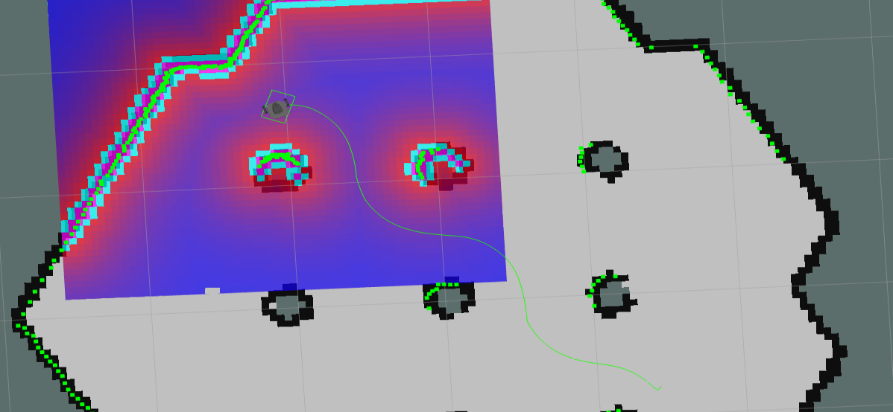

# Установка и запуск TurtleBot3.
Что такое TurtleBot3? Это рельный мобильный робот, обладающий дифференциальным приводом, целым нанабором разлиных сенсоров и комьютером, позволяющим ему автономно работать. Подробнее по нему можно почитать на [сайте](https://emanual.robotis.com/docs/en/platform/turtlebot3/overview/)
> В вводной части уже рассказывалось об основном способе установки нужных нам пакетов. Здесь же мы воспользуемся другим методом: клонируем репозиторий с github и скомпилируем пакеты руками.
>	Для этого первым делом создадим рабочее пространство ROS
```bash
mkdir workspace
catkin_init_workspace
```
>	В появившейся в домашнем каталоге папке workspace создадим еще одну папку src и скачаем в нее код из репозитория
```bash
mkdir src
git clone -b noetic-devel https://github.com/ROBOTIS-GIT/turtlebot3.git
```
> Теперь осталось только скомпилировать пакеты и можно пользоваться. Делать это нужно строго из папки workspace. Для комплиции проектов ROS служит команда:
```bash
catkin_make
```

## Запуск TutrtleBot3
> Перед запуском своих пакетов или тех пакетов, которые сами собирали нужно их подтянуть в рабочее пространство ROS, запуском небольшого автоматически сгенерированного во время компиляции скрапта:
```bash
source devel/setup.bash
```
> Компьютерная модель робота выполнена в симуляторе Gazebo (в качестве испытуемой модели возьмем waffle_pi). Запуск модели в Gazebo:
```bash
export TURTLEBOT3_MODEL=waffle_pi
roslaunch turtlebot3_gazebo turtlebot3_house.launch
```
> На этом моделирование началось и сразу же закончилось. Все следующие решения являются реальными и практически в чистом виде могут использоваться в связке с настоящим роботом. Для начала запустим телеуправление робота.
```bash
roslaunch turtlebot3_teleop turtlebot3_teleop_key.launch 
```
>	Ранее было отмечено, что на роботе установлен ряд датчиков. Одним из них является лидар. С помощью его данных можно достаточно легко сканируя местность построить 2-мерную карту. Технология простоения карты и определение на ней место положения робота носит название SLAM. Для отображения работы и состояния всех систем в реальном времени отлично подходит утилита RVIZ (в наших примерах здесь она запкустится автоматически). Включение SLAM:
```bash
export TURTLEBOT3_MODEL=waffle_pi
roslaunch turtlebot3_slam turtlebot3_slam.launch slam_methods:=hector
```
>	Перемещая робот по смоделированной местности (помним, что у нас еще запущено телеуправление), можно расширить исследованную область на карте. Зачастую, если робото постоянно перемещается по одним и тем же местам, каждый раз пересоздавать карту бессмысленно. В этом случае ее можно сохранить:
```bash
rosrun map_server map_saver -f ~/map
```
>Закроем также и терминал с включенным SLAM.

>	Когда местность исследована, и карта заполнена, можно спокойно запускать робота ездить в автономном режиме. Для этого запустим навигационный пакеты. Для простоты работы можно ему передать уже заполненную карту.
```bash
export TURTLEBOT3_MODEL=waffle_pi
roslaunch turtlebot3_navigation turtlebot3_navigation.launch map_file:=$HOME/map.yaml
```
> Но что, если мы все же хотим двигаться автономно по еще не изученной местности? Можно заметит, что такой запуск системы не очень удобен, да и не всегда есть возможность заранее исследовать местность. Поэтому попробуем сделать так, чтобы робот одновременно строил и дополнял карту, определял себя на ней и двигался к заданной цели.

> К сожалению, существующая программа в том виде, в каком она есть, не поддерживает такую возможность. Поэтому слегка модернизируем ее. Чтобы все получилось, найдем файл `turtlebot3_navigation.launch`, который лежит в `workspace/src/turtlebot3_navigation/launch` и закомментируем аргумент имени файла карты (строка 4), запуск `map server` (строка 14), запуск `amcl` (строка 17), запуск `rviz` (строки 26-29). Все функции, которые сейчас были отключены, отвечали за то, чтобы передать в программу навигации готовую карты и помочь роботу найти себя на ней. 
> Вместо работы с готовой картой мы будем одновременно исследовать ее и определять на ней свое положение. За это как раз отвечала программа SLAM. Поэтому теперь в 3-х разных окнах терминала запустим модель робота в `gazebo`, `slam` и наш отредактированный файл запуска навигации.
 
> Последним штрихом дополним окно `rviz` так, чтобы в нем отображались вещи, связанные с навигацией: карта стоимости `costmap` и планируемая траектория `plan`.
 
> Для этого в окне `rviz` нужно нажать кнопку `add` и во вкладке `by topic` выбрать `move_base/NavfnROS/plan/Path` и `move_base/local_costmap/costmap/Map`.


> А в результате должно получиться что-то такое.



## Задания:
> Попрогбуйте самостоятельно изменить тип робота а также местность, по которой он будет перемещаться.
> Для указания типа робота использовалась команда: `export TURTLEBOT3_MODEL=waffle_pi`.  Доступы следующие варианты робота: burger, waffle, waffle_pi.
> Со списком доспных моделей местности можно ознакомиться, если набрять в терминале `roslaunch turtlebot3_gazebo` и дважды нажать клавишу `Tab`.
