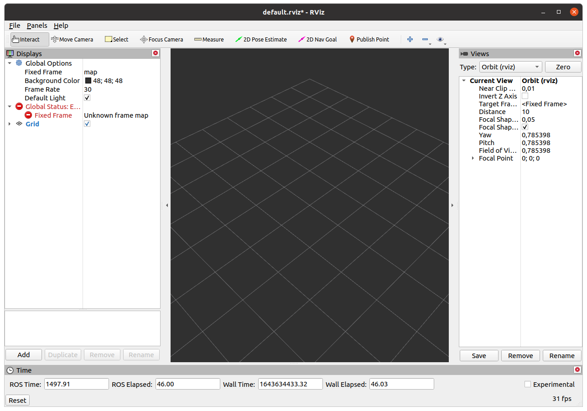
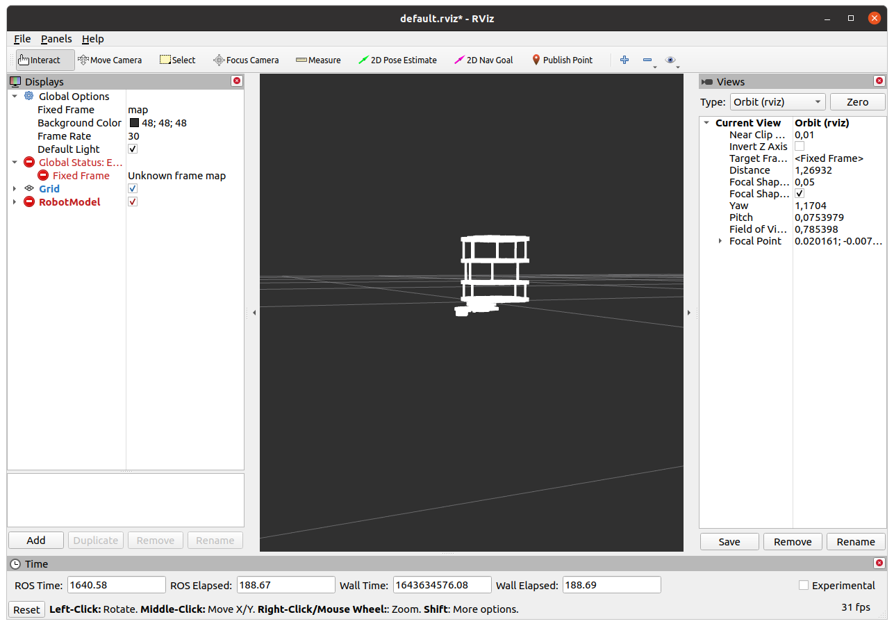
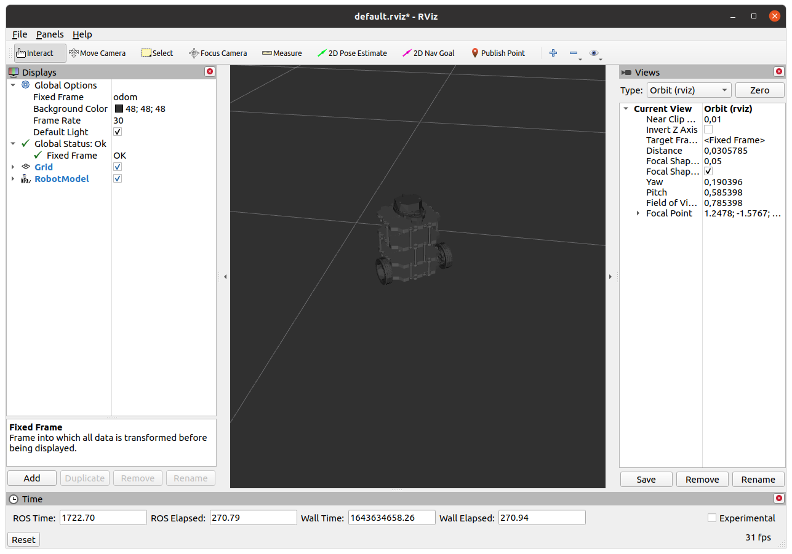
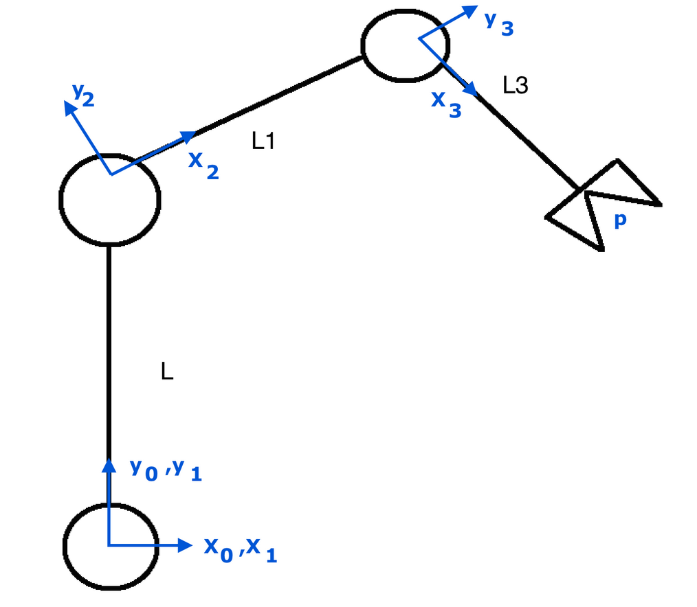

# Добавлени робота в RVIZ. Понятие TF.

Давайте немного внимательнее рассмотрим нашу черепашку Turtlebot3. 
Сначала, как и в предыдущий раз, нужно запустить модель робота. 
```
export TURTLEBOT3_MODEL=burger
roslaunch turtlebot3_gazebo turtlebot3_autorace.launch
```
Далее запусть в новом окне терминала дополнительный launch-файл из состава Turtlebot3.
```
roslaunch turtlebot3_bringup turtlebot3_remote.launch
```
И наконец создадим третье окно терминала и в нем уже запустим RVIZ одноименной командой.
Так будет выглядеть стартовое пустое окно RVIZ:


С помощью кнопки `Add` добавим `RobotModel` и `TF` из вкладки `By display type`.


Как мы видим внешний, робот появился на экране, но его облик существенно отличается от того, который пакзывается в Gazebo. При этом мы видим, что поля слева `Fixed frame` и `RobotModel` подсвечиваются красным и выдают ошибку.
Ошибка эта связана с тем, что у нас неверно выбрана опорная система координат RVIZ, то есть он не знает, с какой системой координат связать собственную координатную сетку. По умолчанию в RVIZ опорная система координат (`Fixed frame`) - всегда `map`. Однако если вверху нажать на выбор опорной системы, то в выпадающем списке мы однаружим, что такой системы не существует (поскольку у нас пока нет карты). Вместо нее пока что выберем `base_footprint`.
Как видим, ошибка исчезла.




С помощью кнопки `Add` добавим отображение еще одного функционала ROS - `TF` из вкладки `By display type`.

 
На экране мы видим, что появилось несколько координатных осей. Причем их центры совпадают с центрами различных частей робота, например, колес и лидара. 
Здесь стоит сделать небольшую паузу и вспомнить основы мехатроники. В грубой трактовке любое мехатронное устройство можно представить, как набор звеньев, созлененных в строго определенной последовательности. У звеньев существует определенная иерархия: есть родительские (parent) и дочерние (child) звенья. У дочернего звена может быть только один родитель, в котором оно и будет позиционироваться. Началось координат звена выступает место его сочленения с родительским звеном.
Схематично это будет выглядеть примерно следующим образом.


> Однако в этом месте возникает проблема. Как нам определить положение, например, исполнительного механизма Р в глобальной системе координат? Нужно использовать матричное преоббразование координат. Его формула известно и не очень сложна, одна это до тех пор пока у нас 1-2 звена. Далее вычисления становятся весьма громоздкими, и их хотелось бы как-то автоматизировать. Данная задача широко известна и ее решение требуется весьма часто, поэтому разработчики создали для нее специализированный пакет `TF`. 

> Данный пакет по получаемым о перемещении робота данным в заданной дискретой времени производит расчет взаимного расположения всех звеньев и сочленений модели. 
Что это за такие данные о перемещении? Например, в основании манипулятора стоит энкодер, который считывает направление поворота первого его звена. При его изменении также меняется положение и всех остальных звеньев в глобальной системе координат, а также относительно другий объектов в пространстве. Соответственно пакет TF заново должен просчитать положение всех звеньев с учетом поступившего изменения. 

> Аналогично может работать, например, колесная одометрия. То есть, зная с какой скоростью вращаются колеса мобильного робота, специальная отдельная программа или ПО микроконтроллера рассчитывают перемещение мобильной базы робота. Вместе с этим также перемещаются и все остальные части робота (колеса, датчики и другие его механизмы), поскольку они все связаны с мобильной базой. Их новое положение также вычисляет TF.

> Систочниками данных о перемещении реальных работов более или мененее понятно. Просто нужно как-то передать данные с датчиков в ROS. Для большинства из них существуют свои уже готовые пакеты. А если есть готовая одометрия, то ее можно завести напрямую по специальному протоколу.

> Однако откуда все это данные берутся у модели роботов? Смоделировать работу настоящего инкрементального или абсолютного энкодера весьма затруднительно. Для этого для моделей в Gazebo служит нода `robot_state_publisher` из одноименного пакета. Следовательно вызов ее из launch-файла будет выглядить следующим образом:
```
  <node pkg="robot_state_publisher" type="robot_state_publisher" name="robot_state_publisher">
    <param name="publish_frequency" type="double" value="50.0" />
  </node>
```

Стоит упомянуть еще одну интересную вещь. ROS имеет ряд собственных стандартов, именуемых `REP (ROS Enhancement Proposals)` https://ros.org/reps/rep-0000.html. 
Один из стандартов относится к системам коодринат, где приведена последовательность следования фреймов, направления осей координат, а также перечень и назначение основных систем координат. Стандар имеет номер `REP 105 Coordinate Frames for Mobile Platforms`. К ознакомлению также рекомендуется стандарт `REP 103 Standard Units of Measure and Coordinate Conventions` о принятых в ROS стандартных единицах измерений. Перед началом разработки собственных модулей рекомендуется с ними ознакомится.
