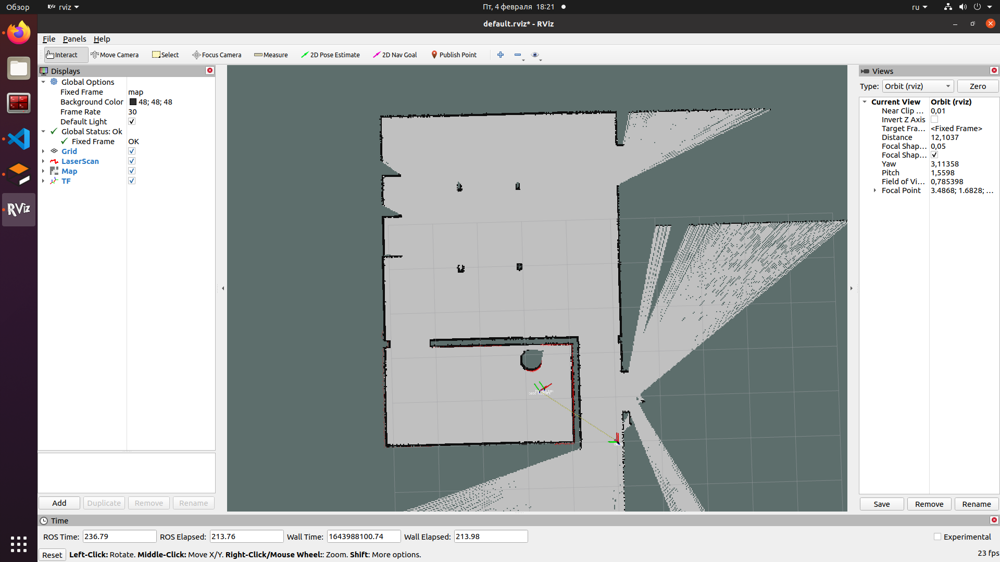

# SLAM и одометрия
### Начнем с того, что разберемся, что такое SLAM?
SLAM — Simultaneous Localization And Mapping — метод одновременной навигации и построения карты — метод, используемый роботами и автономными транспортными 
средствами для построения карты в неизвестном пространстве или для обновления карты в заранее известном пространстве с одновременным контролем текущего 
местоположения и пройденного пути.

Построение карты — это задача интеграции информации, собранной с датчиков робота. При этом процессе робот как бы отвечает на вопрос: «Как выглядит мир?»
Главными аспектами в построении карты являются представление данных об окружающей среде и интерпретация данных с датчиков.
Напротив, локализация — это задача определения местоположения робота на карте. При этом, робот как бы отвечает на вопрос «Где я?»

Локализацию можно разделить на два вида — локальная и глобальная.

Локальная локализация позволяет отследить местоположение робота на карте, когда его начальное местоположение известно, 
а глобальной локализация — это определение местоположения робота на незнакомом месте (например, при похищении робота).

На практике, эти две задачи не могут быть решены независимо друг от друга. Прежде чем робот сможет ответить на вопрос о том, как выглядит окружающая среда 
(исходя из серии наблюдений), он должен знать, где эти наблюдения были сделаны. В то же время, трудно оценить текущее положение робота без карты.

Здесь следует немного подробнее рассказать о том, как робот может определить свое пложение и запечатлеть карту.
Первый и самый простой способ вычислить положение робота - это воспользоваться его одометрией. Для этого всеголишь нужно, если говорим о келесном роботе, повесить на его колеса энкодеры и с помощью простых вычислений определить перемещение. Этот метод весьма прост в реализации, однако за счет того, что энкодеры в основном измеряют скорость, при получении расстояния мы накапливаем ошибку. И естественно чем дальше мы едем, тем эта ошибка будет больше. Поэтому иногда может применяться следующий метод: устанавливают начало координат фрейма одометрии в начальное положение робота, после того, как робот проехал некоторое расстояние, уточняется его положение с помощью различных сенсоров (камера, лидар), фрейм одометрии перемещают в новое уже уточненное положение и продолжают движение.

Однако кроме колес можно использовать и другие датчики в качестве источника одометрии, например лидар, стерео камеру (визаульная одометрия), радар или инерциальный дачик. На их использование накладываются существенные ограничения, но при соблюдении необходимых условий результат может оказаться весьма точным. Например, для лидара и радара требуется наличие большого количества объемных препятствий в пределах дальности их работы. 
Для чего еще может использоваться одометрия? Она упрощают работу алгоритмам оценки положения робота по данным камер и лидаров, сужаю облать поиска. Аналогично это работает и при построении новой карты. Алгоритмы картографирования и локализации в основном основаны на методе фильтра частиц и его модификациях. Простыми словами, его суть заключается в том, что создается большое число предполагаемых точек, в которых может располагаться робот и по ходу его перемещения и изменения показаний сенсоров оценивается степень совпадения их показаний с предполагаемыми. В результате для задачи локализации на известной карте постепенно с отсеиванием ложных точек уточняется положение робота, а для задачи картографирования определяются схожие участки и к ним пристыковываются новые.

В рамках ROS, реализовано несколько алгоритмов SLAM:
1. GMapping — реализация метода SLAM на основе данных от лазерного дальномера и одометрии робота.
2. VSLAM — Visual SLAM — визуальный SLAM — реализация метода SLAM на основе методов компьютерного зрения.
3. hector_mapping — SLAM для платформ без одометрии — только на основе данных от LIDAR-ов. Использует высокую скорость обновления современных систем лазерного 
сканирования, например, Hokuyo UTM-30LX и обеспечивает данные оценки 2D-положения со скоростью сканирования датчиков (40Гц для UTM-30LX).
4. Для активной локализации напрямую основанной на методе фильтра частиц, описанном выше, применяется пакет AMCL.

В рамках данного курса будут рассматриваться реализации SLAM на основе лидара и колесной одометрии робота.
В конце необходимо провести эксперимент и сравнить качество работы GMapping и hector_mapping. 

Итак, разобьем по шагам, что нужно сделать чтобы собрать полноценно работующую систему локализации и картографирования:
1) Определемся с роботом. Нужно понять что у нас есть на борту. Пусть это будут лидар и энкодеры.
2) Если у нас есть энкодеры на колесах, то мы имеем возможность подлючить колесную одометрию (нужно про это не забыть). В случае реального робота придется писать свою ноду для передачи одометрии. Подробное описание с примером можно посмотреть тут: http://wiki.ros.org/navigation/Tutorials/RobotSetup/Odom. Если в нашем проекте мы используем модель turlebot 3 из Gazebo, то специально подводить колесную одометрию там не нужно, однако для свое собственной модели придется модернизировать плагин и в ней также добавлять публикацию одометрии.
3) Следует запустить пакет для работы с лидаром. В случае модели лидар подключается автоматически, когда мы подключаем плагин лидара в модели. Рельный лидар слудет подключить в компьютеру и найти в интернете ПО для работы с ним и подключения его к ROS, например https://github.com/YDLIDAR/ydlidar_ros - пакет для работы c YDlidar.
4)  Перед тем, как мы сможем увидеть в RVIZ данные с лидара необходимо сделать преобразование координат мобльная база -> лидар. 
```xml
<node pkg="tf" type="static_transform_publisher" name="laser_broadcaster" args="0.13125 0 0.14625 0 0 0 base_footprint hokuyo_link 30" />
```
5) Чтобы проверить работу лидара необходимо создать в модели какие-нибудь препятствия. Для этого существуют готовые миры, например:
```xml
  <include file="$(find gazebo_ros)/launch/empty_world.launch">
    <arg name="world_name" value="$(find turtlebot3_gazebo)/worlds/turtlebot3_house.world"/>
    <arg name="paused" value="false"/>
    <arg name="use_sim_time" value="true"/>
    <arg name="gui" value="true"/>
    <arg name="headless" value="false"/>
    <arg name="debug" value="false"/>
  </include>
```

6) Теперь подключим в нашему launch-файлу hector_mapping. Он принимает следующие параметры:
* фрейм карты
* фрейм одометрии
* фрейм робота
* размер карты
* начальная позиция робота на карте
* разрешение карты
* и другие.
```xml
    <node pkg="hector_mapping" type="hector_mapping" name="hector_mapping" output="screen">
        <param name="map_frame"  value="map" />
        <param name="odom_frame" value="odom" />
        <param name="base_frame" value="base_footprint" />

        <param name="use_tf_scan_transformation"  value="true"/>
        <param name="use_tf_pose_start_estimate"  value="false"/>
        <param name="pub_map_scanmatch_transform" value="false" />
        <param name="pub_map_odom_transform"      value="true"/>
        <param name="tf_map_scanmatch_transform_frame_name" value="scanmatcher_frame" />

        <param name="map_resolution" value="0.025"/>
        <param name="map_size"       value="1024"/>
        <param name="map_start_x"    value="0.5"/>
        <param name="map_start_y"    value="0.5" />
    </node>
```


### Задание:
По аналогии с примером, приведенным выше, следует настроить gmapping и сравнить качество его работы с hector mapping. 
